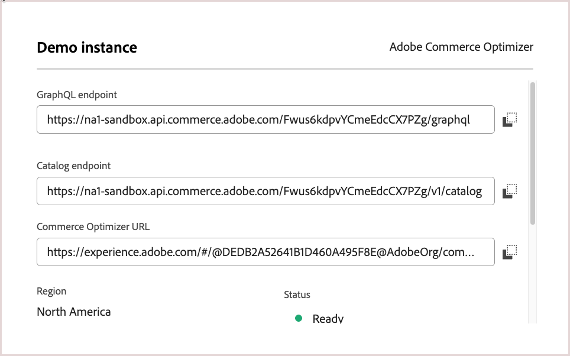

Find your tenant ID in the access URLs for your Commerce Optimizer project in Cloud Manager.

1. Log in to your [Adobe Experience Cloud](https://experience.adobe.com/) account.

1. Under **Quick access**, click **Commerce** to open the Commerce Cloud Manager.

   The Commerce Cloud Manager displays a list of instances that are available in your Adobe IMS organization.

1. To view the access URLs including the base URL for the REST and GraphQL APIs, click the information icon next to the instance name.

   

<InlineAlert variant="info" slots="text" />

If you don't have access to the Commerce Cloud Manager, contact your system administrator.
