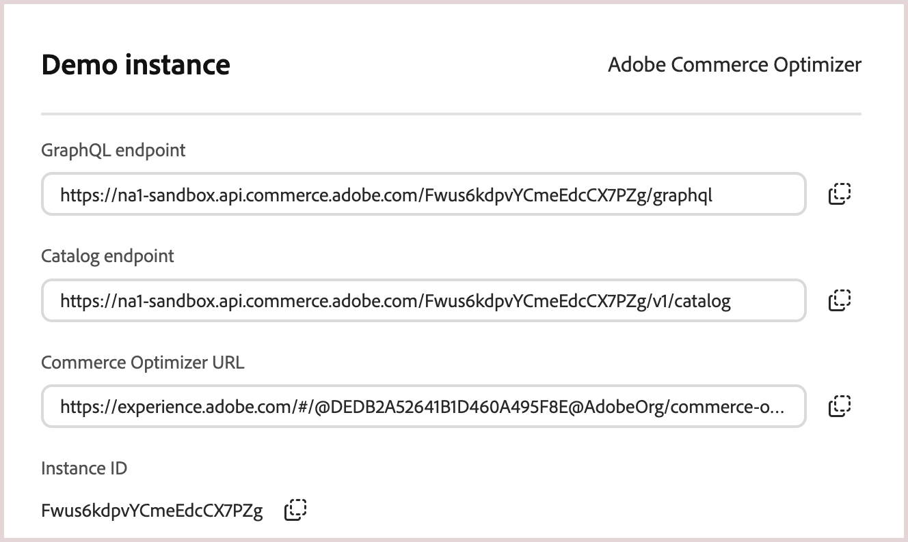

From Cloud Manager, you can find the endpoint URLs and tenant ID (instance ID) in the instance details for your Commerce Optimizer project.

1. Log in to your [Adobe Experience Cloud](https://experience.adobe.com/) account.

1. Under **Quick access**, click **Commerce** to open the Commerce Cloud Manager.

   The Commerce Cloud Manager displays a list of instances that are available in your Adobe IMS organization.

1. To get the base URLs and instance ID, click the information icon next to the Adobe Commerce Optimizer instance name.

   

<InlineAlert variant="info" slots="text" />

If you don't have access to Cloud Manager, you can also find the region and tenant ID from the access URL for the Adobe Commerce Optimizer application interface.
