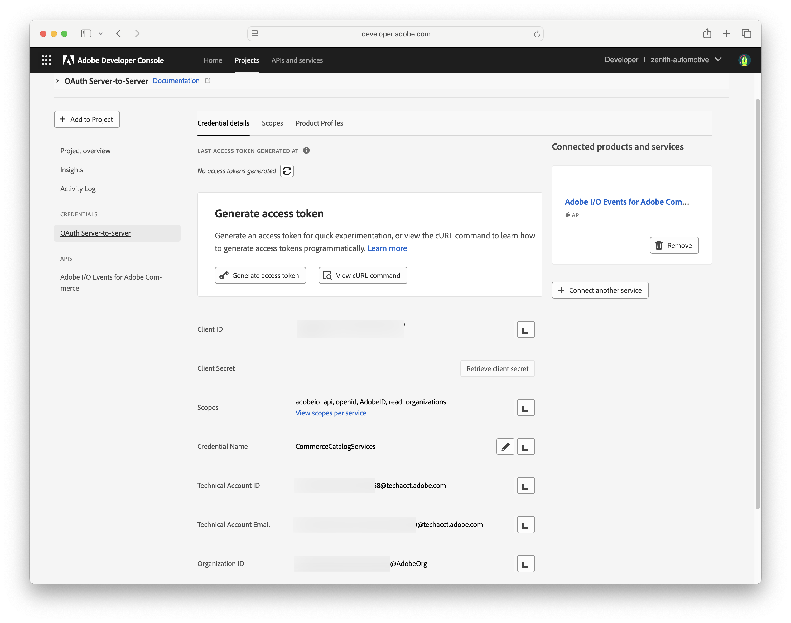

To get API authentication credentials and tokens, create an Adobe developer project to enable communication between your Commerce project and Merchandising Services APIs.

<InlineAlert variant="info" slots="text" />

To create Projects for enterprise organizations, you must have a system administrator or developer role with access to the **Adobe Commerce as a Cloud Service – Backend - Commerce Cloud Manager** product. For information on managing developers from the admin console, see [Managing developers](https://helpx.adobe.com/enterprise/using/manage-developers.html) in the *Adobe Enterprise & Teams Administration Guide*.

1. Log in to the [Adobe Developer Console](https://developer.adobe.com/console).

1. Select the Experience Cloud Organization for the integration.

1. Create an API project.

   1. Add the **Adobe Commerce Optimizer Ingestion** API to your project. Then, click **Next**.

   1. Configure the Client ID and Client Secret credentials by selecting the **OAUTH Server to Server Authentication** option.

   1. Click **Save configured API**.

1. In the Connected Credentials section, view API configuration details by selecting **OAUTH Server-to-Server**.

  

1. Copy the Client ID and the Client Secret values to a secure location.

   - Use the Client ID and Client Secret to refresh expired bearer tokens [using curl].

   - Include the Client ID in the `x-api-key` header to authenticate API requests.

1. Get the bearer access token.

   1. Select **Generate Access Token**.

   1. Save the bearer token to a secure location.

   The bearer token is valid for 24 hours. You can use the same bearer token for all API requests until it expires.
