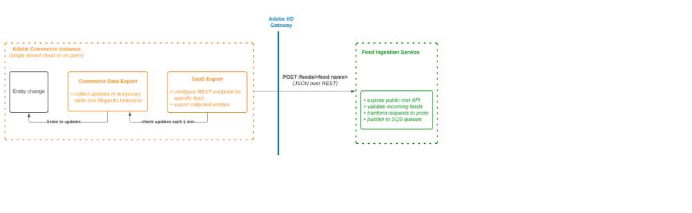

# Commerce Data Export extension

The Commerce Data Export extension is a tool designed to facilitate the synchronization of data between Adobe Commerce and SaaS Commerce Service. It collects and exports various types of data, referred to as "feeds", which aggregate specific pieces of data.  The feeds supported by the Commerce Data Exporter include:  
- Catalog Entities: Includes following feeds `productAttributes` (product attributes), `products`, `prices` (product prices), `variants` (configurable product variations), `categories`, `categoryPermissions`, and `productOverrides` (product permissions).
- Scopes: Includes `scopesWebsite` (websites with stores and store views) and `scopesCustomerGroup` (customer groups).
- Sales Order Entities: Includes `orders` feed which is responsible for collecting orders and order entities (invoice, shipment, credit-memo, etc) data.
- Multi-Source Inventory entities: These include `inventoryStockStatus` feed which collects inventory stock status data for products.

#### Workflow diagram:


#### There area two types of data synchronization between Adobe Commerce and SaaS Commerce Service:

##### Full sync (initial synchronization):
After you [connect Adobe Commerce instance to Commerce Service](https://experienceleague.adobe.com/docs/commerce-merchant-services/user-guides/integration-services/saas.html?lang=en) you need to sync your Adobe Commerce data to SaaS.

##### Partial sync (sync entity updates):
When the Admin user updates some entity, for example, changing a product name from the Admin UI or updating product prices within Magento Import or with a custom solution, the Commerce Data Exporter will send updates to SaaS.

No actions are required from the Admin user or System Integrator. However, to work properly Commerce Data Exporter extension requires proper setup:

- cron is enabled, [see details](https://experienceleague.adobe.com/docs/commerce-operations/installation-guide/next-steps/configuration.html)
Specifically, Commerce Data Exporter underneath uses the following cron jobs
```
- "index" group:
    - "indexer_reindex_all_invalid" job
- "*_data_exporter" group
  _ all jobs
```

- all Commerce Data Exporter indexers are configured in "Update by Schedule" mode. This is forced by default from the extension side starting from 103.1.0 version.
To verify it you can use the following command:
`bin/magento indexer:show-mode | grep -i feed`

#### Retry failed items
If an error happened during the data synchronization process (e.g. application error, network glitch, SaaS service error, etc.) Commerce Data Exporter extension will resend failed items in a separate process.

Implementation is also based on cron jobs.

### Features
- The extension provides two interfaces for data synchronization: a [UI-based interface](https://experienceleague.adobe.com/en/docs/commerce-admin/systems/data-transfer/data-dashboard) and a CLI-interface. The UI-based interface performs a full resync for all available feeds, while the CLI command can be used to sync a specific feed.  The Commerce Data Exporter also supports partial sync, which is triggered by crons when an admin user updates an entity. The extension then sends these updates to SaaS. This process is based on the MView mechanism and requires no actions from the admin user or system integrator.
- Commerce data export also has a mechanism to retry failed items in case of errors during the data synchronization process. This is also based on cron jobs. Extension operates in two modes: Immediate export mode and Legacy export mode. In the Immediate export mode, data is collected and sent immediately to SaaS during one iteration. In the Legacy export mode, data is collected in one process and later sent to SaaS by a cron job.
- CDE logs events such as entity updates or full resync triggers in the var/log/commerce-data-export.log file. Each log record has a specific structure and provides information about the feed, operation, status, elapsed time, process id, and the caller. In case of error happening during the data synchronization process, the extension logs the error message and the stack trace in the var/log/commerce-data-export-errors.log file. To see which entities were sent to SaaS, check the var/log/saas-export.log file. And similar to the exporter logs - to check if there were any errors during the data synchronization process, check the var/log/saas-export-errors.log file.
- There is possibility to run data collection and synchronization in the multiple threads with custom batch size (by default feeds are working in single thread mode and with feeds specific batch size - it's usually 100 records per batch, but for prices feed this value is set to 500 records).

### Entity feeds sync modes
Currently, Commerce Data Exporter handles feeds in 2 modes

- **Immediate export mode.** In this mode, data is collected and sent immediately to SaaS during 1 iteration. It helps to speedup delivering of entity updates to SaaS and reduce the storage size of feed tables.
- **Legacy export mode.** In this mode, data is collected in 1 process. Later cron job sends collected data to SaaS. All legacy feeds will be suffixed with (legacy) text in logs.

### Feeds commands and options
Feeds list:
- products: product data feed
- productAttributes: product attributes data feed
- categories: categories data feed
- variants: configurable product variations data feed
- prices: product prices data feed
- categoryPermissions: category permissions data feed
- productOverrides: product permissions data feed
- inventoryStockStatus: inventory stock status data feed
- scopesWebsite: websites with stores and store views data feed
- scopesCustomerGroup: customer groups data feed
- orders: sales orders data feed

### Commands:
- `bin/magento saas:resync --help` - get list of all available commands and options with their description.
- `bin/magento saas:resync --feed='FEED_NAME'` - run full resync for products feed, feeds which already were in the exporter table with success code in the status field (for immediate export only) will not be resynchronized.
- `bin/magento saas:resync --feed='FEED_NAME' --cleanup-feed` - run full resync for products feed and cleanup all existing data in the feed table.

### Multi-thread data export mode:
The purpose of this mode is to speed up the export process by splitting the data into batches and processing them in parallel. **_The performance of data export should be aligned with the limit that is defined for a client at consumer side._**

The multi-thread data export mode is applied for full and partial reindex.
It may be useful to change `thread_count` and `batch_size` in runtime when performing data export via CLI command. This can be done by passing the options --thread-count, --batch-size to the saas:resync command.

For example:
```bash
bin/magento indexer:reindex catalog_data_exporter_products --thread-count=5 --batch-size=400
```

### Troubleshooting:
If you see that some entities are not sent to SaaS or data exporter entities have any code different from _success_ (200) in the status field of the data exporter table. It makes sense to turn in extended logging and observe the logs after resync operation. To turn on extended logging, you need to put the `EXPORTER_EXTENDED_LOG=1` environment variable before `saas:resync` command.

_Example:_
```shell
EXPORTER_EXTENDED_LOG=1 bin/magento saas:resync --feed='products'
```
It will enable extended logging for the feed collecting and synchronization process.

When an entity update is detected or full resync is triggered this event will be logged in var/log/commerce-data-export.log  file

Each log record has the following structure (note JSON-based string is beautified for better readability)

```log
[<log record datetime>] report.<log level>:
{
   "feed": "<feed name>",
   "operation": "<executed operation>",
   "status": "<status of operation>",
   "elapsed": "<time elaspsed from script run>",
   "pid": "<proccess id who executed `operation`>",
   "caller": "<who called this `operation`>"
} [] []
```


During full resync, by default, each 30 seconds progress track will be logged, here is example:

```json
{
   "feed": "prices",
   "operation": "full sync",
   "status": "Progress: 2/5, processed: 200, synced: 100",
   "elapsed": "00:00:00 190 ms",
   "pid": "12824",
   "caller": "bin/magento saas:resync --feed=products"
}
```
- "Progress 2/5" - 2 from 5 iterations completed. The number of iterations depends on the number of exported entities.
- "processed: 200" - 200 items have been processed so far
- "synced: 100" - 100 items were sent to SaaS. It's expected that "synced" is not equal to "processed". Here is an example:
  - "synced" < "processed" - feed table didn't detect any changes in the item, compared to the previously synced version. Such items will be ignored during sync.
  - "synced" > "processed"  - the same entity id (e.g. Product ID) can have multiple values in different scopes. For example, 1 product can be assigned to 5 websites. In this case you may have "1 processed" item and "5 synced" items

Out-of-the-box extension provides the following operations you can see in logs file:

| Operation                  | Description                                                                                                                                 | Caller example                                                                       |
|----------------------------|---------------------------------------------------------------------------------------------------------------------------------------------|--------------------------------------------------------------------------------------|
| full sync                  | execute full sync (collect data and send to SaaS) of a given feed                                                                           | bin/magento saas:resync --feed=products                                              |
| partial reindex            | execute sync (collect data and send to SaaS) of updated entities of a given feed. Note: log will be present only if updated entities exist  | bin/magento cron:run --group=index                                                   |
| retry failed items         | resend failed (due to AC application or server error) items of a given feed to SaaS. Note: log will be present only if failed items exist.  | bin/magento cron:run --group=saas_data_exporter  (any "*_data_exporter" cron group)  |
| full sync(legacy)          | execute full sync (collect data and send to SaaS) of a given feed for legacy export mode.                                                   | bin/magento saas:resync --feed=categories                                            |
| partial reindex (legacy)   | sends updated entities to SaaS of a given feed in legacy export mode. Note: log will be present only if updated entities exist              | bin/magento cron:run --group=index                                                   |
| partial sync (legacy)      | sends updated entities to SaaS of a given feed in legacy export mode. Note: log will be present only if updated entities exist              | bin/magento cron:run --group=saas_data_exporter (any "*_data_exporter" cron group)   |

Here is an example of feed logs:
```log
Price feed full resync:

[2024-03-05T21:00:51.754687+00:00] report.INFO: {"feed":"prices","operation":"full sync","status":"Initialize","elapsed":"383 ms","pid":"14469","caller":"bin\/magento saas:resync --feed=prices"} [] []
[2024-03-05T21:00:51.803178+00:00] report.INFO: {"feed":"prices","operation":"full sync","status":"Creating batch table `catalog_data_exporter_product_prices_index_batches`. Start position: 30515","elapsed":"434 ms","pid":"14469","caller":"bin\/magento saas:resync --feed=prices"} [] []
[2024-03-05T21:00:51.851878+00:00] report.INFO: {"feed":"prices","operation":"full sync","status":"Batch table `catalog_data_exporter_product_prices_index_batches` created. Total Items: 500, batches: ~1","elapsed":"482 ms","pid":"14469","caller":"bin\/magento saas:resync --feed=prices"} [] []
[2024-03-05T21:00:51.852548+00:00] report.INFO: {"feed":"prices","operation":"full sync","status":"start processing `500` items in `1` threads with `500` batch size","elapsed":"483 ms","pid":"14469","caller":"bin\/magento saas:resync --feed=prices"} [] []
[2024-03-05T21:00:52.288369+00:00] report.INFO: {"feed":"prices","operation":"full sync","status":"Progress 1\/1, processed 500, synced 0","elapsed":"919 ms","pid":"14469","caller":"bin\/magento saas:resync --feed=prices"} [] []
[2024-03-05T21:00:53.994249+00:00] report.INFO: {"feed":"prices","operation":"full sync","status":"Progress 1\/1, processed 500, synced 100","elapsed":"00:00:02 625 ms","pid":"14469","caller":"bin\/magento saas:resync --feed=prices"} [] []
[2024-03-05T21:00:53.995168+00:00] report.INFO: {"feed":"prices","operation":"full sync","status":"Complete","elapsed":"00:00:02 626 ms","pid":"14469","caller":"bin\/magento saas:resync --feed=prices"} [] []
```
