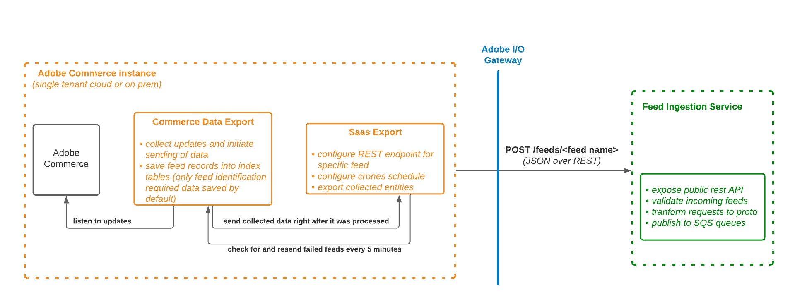

<- [Back to overview page](commerce-data-export-overview.md)

# Data Synchronization

#### Data Synchronization diagram:
[Diagram](https://lucid.app/lucidchart/a6818329-c0d3-46fa-95a2-fe0791a479a9/edit?viewport_loc=-248%2C-258%2C2322%2C1222%2C0_0&invitationId=inv_865c79fb-beb0-43d5-8d6f-0930f14215b5) 



### Entity feeds sync modes
Currently, Commerce Data Exporter handles feeds in 2 modes

- **Immediate export mode.** In this mode, data is collected and sent immediately to SaaS during 1 iteration. It helps to speedup delivering of entity updates to SaaS and reduce the storage size of feed tables.
- **Legacy export mode.** In this mode, data is collected in 1 process. Later cron job sends collected data to SaaS. All legacy feeds will be suffixed with (legacy) text in logs.

### There area three types of data synchronization between Adobe Commerce and Adobe Commerce Services:

#### Full sync (initial synchronization):
After you [connect Adobe Commerce instance to Commerce Service](https://experienceleague.adobe.com/docs/commerce-merchant-services/user-guides/integration-services/saas.html?lang=en) you need to sync your data to Adobe Commerce Services.

Please **NOTE:** The full resync is suitable only for onboarding phase and should not be used on regular basis since it adds extra load on Database.  [Partial sync](commerce-services/src/pages/catalog-data-export/workflow.md:16) that executed via crons automatically - should be used instead, to propagate changes.

#### Partial sync (sync entity updates):
When the Admin user updates some entity, for example, changing a product name from the Admin UI or updating product prices within Magento Import or with a custom solution, the Commerce Data Exporter will send updates to SaaS.

No actions are required from the Admin user or System Integrator. However, to work properly Commerce Data Exporter extension requires proper setup:

- cron is enabled, [see details](https://experienceleague.adobe.com/docs/commerce-operations/installation-guide/next-steps/configuration.html)
  Specifically, Commerce Data Exporter underneath uses the following cron jobs
```
- "index" groups:
    - "indexer_reindex_all_invalid" job - during this job execution all invalid feeds will be reindexed. It's a standard Adobe Commerce cron job which runs every minute.    
    - "saas_data_exporter" job - for legacy export feeds (runs every minute)
    - "sales_data_exporter" job - specific for sales data export feed (runs every minute)
```

- all Commerce Data Exporter indexers are configured in "Update by Schedule" mode. This is forced by default from the extension side starting from 103.1.0 version.
  To verify it you can use the following command:
  `bin/magento indexer:show-mode | grep -i feed`

#### Retry failed items (sync items which were not sent due to errors):
If an error happened during the data synchronization process (e.g. application error, network glitch, SaaS service error, etc.) Commerce Data Exporter extension will resend failed items in a separate process.

Implementation is also based on cron jobs.
```
- "index" groups:
    - "resync_failed_feeds_data_exporter" job - for immediate export feeds (runs every 5 minutes)
```
