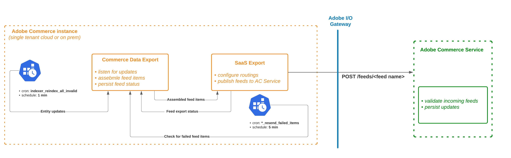

<- [Back to overview page](commerce-data-export-overview.md)

# Workflow

#### Workflow diagram:
[Diagram](https://lucid.app/lucidchart/a6818329-c0d3-46fa-95a2-fe0791a479a9/edit?viewport_loc=-248%2C-258%2C2322%2C1222%2C0_0&invitationId=inv_865c79fb-beb0-43d5-8d6f-0930f14215b5) 


#### There area two types of data synchronization between Adobe Commerce and Adobe Commerce Services:

##### Full sync (initial synchronization):
After you [connect Adobe Commerce instance to Commerce Service](https://experienceleague.adobe.com/docs/commerce-merchant-services/user-guides/integration-services/saas.html?lang=en) you need to sync your data to Adobe Commerce Services.

##### Partial sync (sync entity updates):
When the Admin user updates some entity, for example, changing a product name from the Admin UI or updating product prices within Magento Import or with a custom solution, the Commerce Data Exporter will send updates to SaaS.

No actions are required from the Admin user or System Integrator. However, to work properly Commerce Data Exporter extension requires proper setup:

- cron is enabled, [see details](https://experienceleague.adobe.com/docs/commerce-operations/installation-guide/next-steps/configuration.html)
  Specifically, Commerce Data Exporter underneath uses the following cron jobs
```
- "index" group:
    - "indexer_reindex_all_invalid" job
- "*_data_exporter" group
  _ all jobs
```

- all Commerce Data Exporter indexers are configured in "Update by Schedule" mode. This is forced by default from the extension side starting from 103.1.0 version.
  To verify it you can use the following command:
  `bin/magento indexer:show-mode | grep -i feed`

#### Retry failed items
If an error happened during the data synchronization process (e.g. application error, network glitch, SaaS service error, etc.) Commerce Data Exporter extension will resend failed items in a separate process.

Implementation is also based on cron jobs.