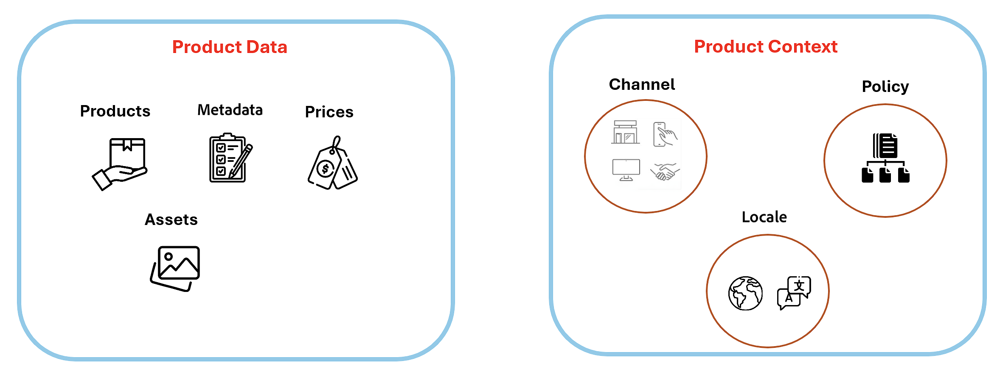

# Merchandising Services powered by Channels and Policies overview

This guide offers API reference and usage information for developers and commerce site administrators involved in storefront development, maintenance, and operations.
## Overview

Merchandising Services powered by Channels and Policies offers a set of APIs that enable developers to implement large, complex catalogs and develop highly performant storefront experiences. Merchandising Services provides a data model that separates product data from product context, allowing businesses to compose custom catalogs for different business models, such as B2B, B2C, and D2C and to manage the catalogs in a way that aligns with their go-to-market strategies.

- **Product data** provides the details about the products to be sold-sku, attributes, metadata, and assets data, and prices for each item.

- **Product context** defines the business context for the products including distribution channels, data access policies for catalog syndication, and language (`locale`) scope for the catalog.

Together, these components enable the creation of custom catalogs that power storefront experiences.

## Composable catalogs

Composable catalogs are a key feature of Merchandising Services. They are created by combining product data with product context to create a catalog that is tailored to specific business needs. Custom catalogs can:

Composable catalogs are a key feature of Merchandising Services, created by combining product data with product context to tailor catalogs to specific business needs. Custom catalogs can:

- Support various business models (B2B, B2C, D2C).
- Power storefront experiences across web, mobile, and in-store channels.
- Be managed independently of product data for flexibility and scalability.
- Cater to different locales with regional settings for language, currency, and units of measure.
- Implement policies for customer-specific pricing and business rules.
- Target different audiences for marketing and sales efforts.
- Focus on specific product sets for targeted marketing and sales.

## API resources

Developers can use Merchandising Services APIs to manage product data and product context independently to compose custom catalogs for storefront experiences. The APIs are available in both GraphQL and REST.

**Data Ingestion APIs**—REST API to add and manage product and pricing data for merchandising across multiple business channels and locales. Data includes products, product attribute metadata, price books, and prices. Data can be added directly using the API or ingested from third-party systems.

**Channels and Policies APIs**—GraphQL API to manage product context, including distribution channels, locales, and policies. Product context is used to filter products into custom catalogs with customer-specific pricing and regional settings for language, currency, and units of measure.

**Storefront API**—GraphQL API to access rich view-model (read-only) catalog data to build product-related storefront experiences. The Storefront API is designed to be used by frontend applications to access catalog data.
