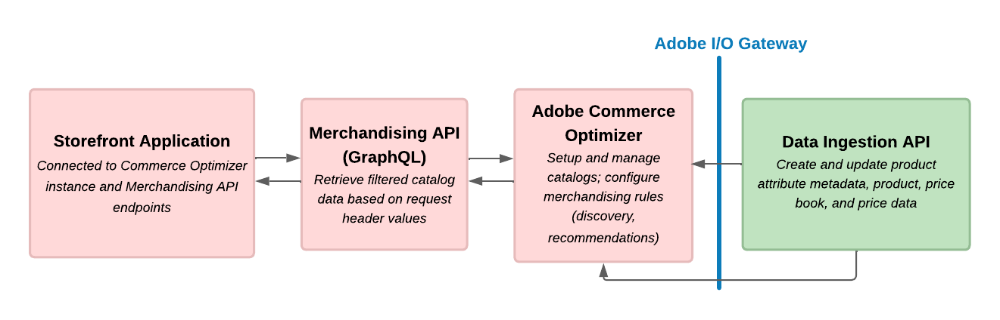

# Retrieve catalog data with the Merchandising API

The Merchandising GraphQL API enables developers to build rich, dynamic storefront experiences by providing efficient access to catalog data from Adobe Commerce Optimizer. This API is designed for frontend applications that need to retrieve product information, pricing, search results, and recommendations in real-time.

The Merchandising API is part of Adobe Commerce Optimizer's composable commerce architecture, which separates product data from business context. This separation allows you to:

- **Build flexible storefronts** that can adapt to different business models (B2B, B2C, D2C)
- **Deliver personalized experiences** based on customer segments, regions, and channels
- **Scale efficiently** with optimized GraphQL queries that fetch only the data you need
- **Maintain performance** with built-in caching and CDN integration

### Key Benefits

- **Real-time data access** to product catalogs, pricing, and inventory
- **Flexible querying** with GraphQL for efficient data retrieval
- **Multi-channel support** for different storefront types and devices
- **Localization ready** with built-in support for multiple locales and currencies
- **Performance optimized** with intelligent caching and query optimization

### When to Use the Merchandising API

The Merchandising API is ideal for:

- Real-time access to product catalog data
- GraphQL-based querying for efficient data retrieval
- Multi-channel commerce support (B2B, B2C, D2C)
- Personalized product recommendations
- Advanced search and filtering capabilities
- Composable commerce architecture
- Building dynamic storefronts that require up-to-date product information
- Integrating with Adobe Commerce Optimizer for product and pricing data

## Architecture

The Merchandising API sits between your storefront applications and the Adobe Commerce Optimizer data layer:

This diagram illustrates the flow of data between the storefront, the Merchandising API, and the Adobe Commerce Optimizer backend:

1. **Storefront Request**: Your application sends GraphQL queries to the Merchandising API
2. **Context Processing**: The API applies catalog views, policies, and catalog source locale filters based on the request headers
3. **Data Retrieval**: Optimized queries fetch relevant product and pricing data
4. **Response**: Structured data is returned to your application for rendering

Product catalog updates delivered directly through data ingestion API requests, or a third-party app integration are synchronized to Adobe Commerce Optimizer, ensuring that the Merchandising API always serves the latest data.

## Integration Options

### Adobe Edge Delivery Services

If your storefront uses Adobe Edge Delivery Services, integration is configured through the storefront configuration and Commerce drop-in components. See the [Adobe Commerce Storefront documentation](https://experienceleague.adobe.com/developer/commerce/storefront/get-started/) for detailed configuration instructions.

### Third-Party Integrations

For custom storefronts built with frameworks like React, Vue.js, Angular, or any other technology:

- **Direct API Integration**: Use GraphQL clients to connect directly to the [Merchandising API](using-the-api.md) from your frontend application
- **GraphQL Client Libraries**: Use libraries like Apollo Client, Relay, or urql for efficient GraphQL data fetching
- **Adobe Developer App Builder**: Use [Adobe Developer App Builder](https://experienceleague.adobe.com/en/docs/commerce-learn/tutorials/adobe-developer-app-builder/introduction-to-app-builder) to create custom applications that leverage the Merchandising API
- **Headless CMS**: Integrate with headless CMS platforms for content management

## Security

### Authentication

- **API Key Protection**: Never expose API keys in client-side code
- **HTTPS**: Always use HTTPS for production environments
- **Request Validation**: Validate all user inputs before sending to the API

### Data Access

- **Catalog Views**: Use catalog views to control data access based on business context
- **Policies**: Implement policies to filter data based on customer segments
- **Locale Filtering**: Use locale headers to ensure appropriate data is returned
- **Price Books**: Use price book headers to manage pricing data returned across different customer segments and regions

## Next Steps

See the [Get Started with the Merchandising API](using-the-api.md) section for instructions on how to set up your environment and start using the API.

## Related Documentation

- **[Data Ingestion API](../data-ingestion/index.md)**: Ingest and manage product and pricing data
- **<a href="https://experienceleague.adobe.com/docs/commerce/optimizer/setup/catalog-view.html" target="_blank" rel="noopener noreferrer">Catalog Management</a>**: Set up catalog views and policies in Adobe Commerce Optimizer
- **<a href="https://developer-stage.adobe.com/commerce/services/composable-catalog/reference/graphql/index.html" target="_blank" rel="noopener noreferrer">Merchandising API Reference</a>**: Merchandising API Reference
- **[GraphQL Queries](use-cases.md#available-queries)**: Available queries

For additional support and community resources, visit the [Adobe Commerce Developer Portal](https://developer.adobe.com/commerce/).
