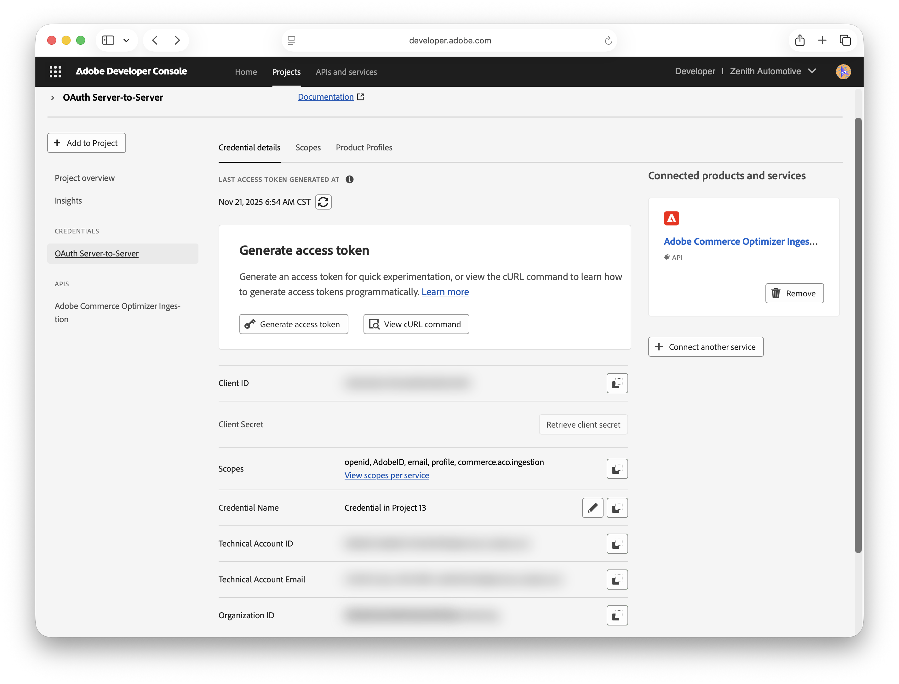

# REST authentication

Adobe Commerce Optimizer uses Adobe's Identity Management Service (IMS) with OAuth 2.0 for secure API access. This system supports both user-based workflows and automated integrations.

This guide covers direct API access using bearer tokens generated from your Adobe developer project. Tokens expire after 24 hours and can be refreshed using your project credentials.

<InlineAlert variant="info" slots="text" />

For more information about IMS user authentication for other use cases, see [User Authentication](https://developer.adobe.com/developer-console/docs/guides/authentication/UserAuthentication/implementation) in the *Adobe Commerce REST Guide*.

## Obtain IMS credentials

For direct access to the Data Ingestion API, you must authenticate using an access token.
`Authorization: {accessToken}`

This token is generated from the credentials of an Adobe developer project that is configured for API access. The token is valid for 24 hours. When it expires, use the Adobe developer project credentials to [generate a new one](#generate-a-new-access-token).

<InlineAlert variant="info" slots="text" />

Creating projects for enterprise organizations requires a system administrator or developer role with access to the **Adobe Commerce – Commerce Cloud Manager** product. For information on managing developers from the Admin console, see [Managing developers](https://experienceleague.adobe.com/en/docs/commerce/optimizer/user-management) in the *Adobe Commerce Optimizer Guide*.

<Details slots="text, list" repeat="1" summary="Get credentials and access tokens" />

To get API authentication credentials and tokens, create an Adobe developer project to enable communication between your Commerce project and Merchandising Services APIs.

1. Log in to the [Adobe Developer Console](https://developer.adobe.com/console).

   You can also access the Developer Console from the **Get Credentials** section of the [Data Ingestion API Reference](https://developer.adobe.com/commerce/services/reference/rest/). If you use this method, you are automatically directed to the correct organization. You can complete the process to create credentials and generate an access token from there.

1. Select the Experience Cloud Organization for the integration.

1. Create an API project.

   1. Add the **Adobe Commerce Optimizer Ingestion** API to your project. Then, click **Next**.

   1. Configure the Client ID and Client Secret credentials by selecting the **OAUTH Server to Server Authentication** option.

   1. Click **Save configured API**.

1. In the Connected Credentials section, view API configuration details by selecting **OAUTH Server-to-Server**.

   

1. Copy the Client ID and the Client Secret values to a secure location.

   You use these values to refresh expired bearer tokens.

1. Get the bearer access token.

   1. Select **Generate Access Token**.

   1. Save the bearer token to a secure location.

   The bearer token is valid for 24 hours. You can use the same bearer token for all API requests until it expires.

## Generate a new access token

Once you have the required credentials for IMS authentication, use the following cURL request to generate a new bearer token after the current token expires:

```shell
curl --request POST \
  --url 'https://ims-na1.adobelogin.com/ims/token/v3' \
  --header 'Content-Type: application/x-www-form-urlencoded' \
  --data 'grant_type=client_credentials' \
  --data 'client_id={{clientId}}' \
  --data 'client_secret={{clientSecret}}' \
  --data 'scope=openid,AdobeID,profile,email,commerce.aco.ingestion'
```

Replace the following placeholders with your credentials:

- `\{{clientId}}`: The client ID generated for your Adobe developer project
- `\{{clientSecret}}`: The client secret generated for your Adobe developer project

You can get these credentials from the Adobe Developer Console project details page. If you don't have access to the developer console, contact your system administrator for assistance.

<InlineAlert variant="info" slots="text" />

This token request provisions the required scopes for Adobe Commerce Optimizer data ingestion as listed in the `scope` parameter. For information on managing, refreshing, and revoking bearer tokens, see [User Authentication](https://developer.adobe.com/commerce/webapi/rest/authentication/user/) in the *Adobe Commerce REST Guide*.
