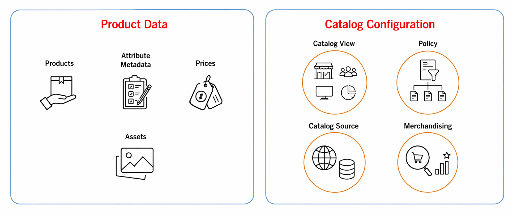

<Edition slots="text" backgroundColor="green"/>
[SaaS only](https://experienceleague.adobe.com/en/docs/commerce/user-guides/product-solutions)

# Merchandising Services Developer Guide

<InlineAlert variant="info" slots="text"/>

This guide provides API reference and usage information for Commerce customers using Adobe Commerce Optimizer. If you are using Adobe Commerce storefront services without Adobe Commerce Optimizer, see the [Adobe Storefront Services GraphQL](https://developer.adobe.com/commerce/webapi/graphql/schema/storefront-services/) documentation.

This guide focuses on the API components of Adobe Commerce Optimizer Merchandising Services. It provides endpoint, authentication, and API reference information for developers who need to ingest catalog data, connect storefront applications, and retrieve storefront-ready catalog data. It also introduces the Commerce Optimizer Studio concepts that shape API output, such as catalog views, policies, merchandising rules, and recommendations.

Developers can use Commerce Optimizer Merchandising Services to implement large, complex catalogs and build highly performant storefront experiences. Merchandising Services provides a data model that separates product data from product context, allowing businesses to compose custom catalogs for different business models, such as B2B, B2C, and D2C and manage the catalogs in ways that align with their go-to-market strategies.

- **Product data** includes the details about the products to be sold-SKUs, products, product and category metadata, assets, and pricing data.

- **Catalog configuration** determines how ingested catalog data is exposed for specific business contexts. After data is ingested and catalog sources are established, admins use Commerce Optimizer Studio to configure catalog views and policies that control which products and prices are delivered for specific channels, locales, and audiences. Catalog views and policies are managed in Adobe Commerce Optimizer Studio.

Adobe Commerce Optimizer can expose this catalog model to Adobe Commerce Storefront on Edge Delivery Services or to custom headless storefronts. In both cases, storefront applications use the read-only Merchandising API to retrieve the catalog data defined by ingested product data and the catalog view and policy configuration created in Commerce Optimizer Studio.

In addition to catalog modeling and delivery, Adobe Commerce Optimizer lets teams configure merchandising rules to influence product visibility and ranking in search results, category pages, and default product listings, and create product recommendations that use Adobe AI and aggregated storefront behavior to deliver personalized product suggestions.

Developers use these components together to compose and deliver tailored storefront experiences quickly, without duplicating base catalog data.

<InlineAlert variant="info" slots="text"/>

For additional architecture and implementation details, see the [Adobe Commerce Optimizer Guide](https://experienceleague.adobe.com/en/docs/commerce/optimizer/overview) in Experience League.

## Resources

Adobe Commerce Optimizer Merchandising Services provides the following APIs and configuration tools:

* **[Data Ingestion API](data-ingestion/index.md)** — REST API to add and manage product and pricing data for merchandising across multiple business channels and locales. Data includes attribute metadata, categories, products, price books, prices, and product layers. The API expects data in JSON format, which can be added to the Merchandising services data pipeline directly using the API or ingested from third-party systems. Ingested data establishes the catalog sources and attribute behavior used by storefront and merchandising experiences.

 <InlineAlert variant="info" slots="text"/>

 If you are using the [Adobe Commerce Optimizer Connector](https://experienceleague.adobe.com/en/docs/commerce/aco-optimizer-connector/overview), data is ingested directly from the connected Adobe Commerce environment rather than through the Data Ingestion API.

* **Catalog Views and Policies** — After catalog data is ingested into Adobe Commerce Optimizer, admins use Commerce Optimizer Studio to configure catalog views and policies. Ingested data establishes the available catalog sources, product attributes, and pricing inputs. Catalog views define how a shared catalog is exposed for specific channels, locales, and audiences. Policies apply attribute-based filters to control which products are included in each view. These configurations are managed in Commerce Optimizer Studio, not through the Merchandising Services APIs. For details, see the [Storefront and Catalog Administrator End-to-End Use Case](https://experienceleague.adobe.com/en/docs/commerce/optimizer/use-case/admin-use-case).

* **Merchandising configuration** - Use Commerce Optimizer Studio to configure product discovery and recommendations for your storefront. From the [Merchandising menu](https://experienceleague.adobe.com/en/docs/commerce/optimizer/merchandising/overview), you can manage merchandising rules, facets, synonyms, and recommendation units. These configurations are managed in Adobe Commerce Optimizer Studio and work with catalog views and policies to shape search behavior, product ranking, and personalized recommendations.

* **Storefront Integration** - Connect an Edge Delivery Services or headless storefront to the configured instance

  Adobe Commerce Optimizer supports both Adobe Commerce Storefront on Edge Delivery Services and custom headless storefronts. Storefront applications connect to the appropriate tenant, catalog view, and Merchandising API endpoints to retrieve storefront-ready catalog data.

* **[Merchandising API](merchandising-services/index.md)** — Read-only GraphQL API to access rich view-model catalog data for storefront experiences

   Developer use the Merchandising API to:

  * power Adobe Commerce Storefront on Edge Delivery Services and storefront drop-ins
  * connect custom headless storefronts
  * expose catalog data to third-party services and integration layers.

  The data returned by the API reflects the ingested catalog data and the catalog views, policies, and merchandising configuration defined in Commerce Optimizer Studio.

## Typical Merchandising Services workflow
