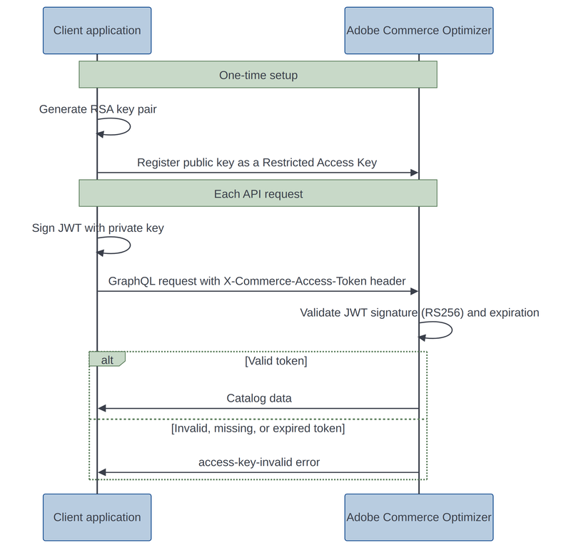

<Edition slots="text" backgroundColor="green"/>
[SaaS only](https://experienceleague.adobe.com/en/docs/commerce/user-guides/product-solutions)

# Get started with the Merchandising API

Use the Merchandising API to retrieve product data from your Commerce catalogs and display it in Commerce frontend experiences. Data includes products, categories, product and category attribute metadata, price books, and prices.

## Prerequisites

Before using the Merchandising API, ensure you have:

- **Adobe Commerce Optimizer access**: Active subscription and the instance ID associated with your Adobe Commerce Optimizer instance
- **Catalog data**: Products and pricing data ingested via the [Data Ingestion API](../data-ingestion/index.md)
- **Catalog views**: Configured views and policies in Adobe Commerce Optimizer
- **Authentication Setup**: Proper headers configured for API requests
- **GraphQL Client**: A tool or library to make GraphQL requests (e.g., Postman, Apollo Client, or cURL)
- **Familiarity with GraphQL**: Basic understanding of GraphQL queries and mutations
- **Development Environment**: Set up for testing API requests (e.g., local development server or staging environment)

## Merchandising API overview

The Merchandising API is a GraphQL API that allows you to access real-time catalog, product discovery, and recommendations data from Adobe Commerce Optimizer. It is designed for backend applications to retrieve product data for use in frontend experiences. All product and price data is stored in a single base catalog that can be filtered and configured to create custom catalogs using Adobe Commerce Optimizer. This approach reduces processing time and improves catalog performance, especially for merchants with large or complex product assortments.

### Base URL

Send all Merchandising API requests to this base URL:

```text
https://na1-sandbox.api.commerce.adobe.com/{{tenantId}}/graphql
```

The URL structure is:

```https://{{region}}-{{environment}}.api.commerce.adobe.com/{{tenantId}}```

- `region` is the cloud region where your instance is deployed.
- `environment` is present only for non-production `sandbox` environments.
- `tenantId` is the unique identifier for your organization's specific instance within the Adobe Experience Cloud.

<InlineAlert variant="info" slots="text" />

Sandbox instances are available only in the North America region.

#### Get your endpoint URL and tenant ID

<Fragment src="../../includes/authentication/get-tenant-id.md" />

### Authentication

Authentication is not required for the Merchandising API by default.

However, requests for data from private catalog views configured with catalog protection and restricted access keys must include a valid, signed JSON Web Token (JWT) in the `AC-Catalog-View-Access-Token` header.

Setting up a private catalog view is the responsibility of your client application:

- **Generate an RSA key pair.** The public key must be PEM-encoded and between 2048 and 8192 bits.
- **Register the public key** as a restricted access key on the catalog view. See [Restricted access keys](https://experienceleague.adobe.com/en/docs/commerce/optimizer/setup/restricted-access-keys) and [Protect a catalog view](https://experienceleague.adobe.com/en/docs/commerce/optimizer/setup/catalog-view#protect-a-catalog-view).
- **Keep the private key** on your system, and use it to sign a JWT for each request.

Adobe Commerce Optimizer validates each token's `RS256` signature against the restricted access keys assigned to the catalog view, and returns catalog data only if the signature is valid and neither the token nor the key has expired.



A request to a private catalog View without a valid token returns a GraphQL error instead of data:

```json
{
  "errors": [
    {
      "message": "Access key validation failed: Missing token",
      "extensions": { "x-commerce-exception": "access-key-invalid" }
    }
  ]
}
```

The `message` field describes why validation failed:

| Reason | Cause |
|---|---|
| `Missing token` | No `AC-Catalog-View-Access-Token` header was sent on a private catalog view. |
| `Access token signature invalid` | The token's signature doesn't verify against any restricted access key assigned to the catalog view, for example because it was signed with the wrong key or was tampered with. |
| `Restricted access is enabled but no valid access keys are available` | Catalog Protection is enabled, but no restricted access keys are assigned to the catalog view, or every assigned key has expired. |

A token that has passed its own expiration date is denied the same way, even if the signature would otherwise validate.

### Headers

When making requests to the Merchandising API, you must include required HTTP headers that provide necessary information, such as the catalog view ID, catalog source locale. Additionally, you can include optional policy and price book headers that tailor the API response to your needs.

| Header name| Description |
|--------------|-------------|
|`AC-View-ID` | Required. The unique ID assigned to the catalog view that products will be sold through. For example, in the automotive industry, the catalog view could be dealers. In the manufacturing industry, the view could be a manufacturing location for suppliers. You can view the list of available catalog views and find the viewID from the [Adobe Commerce Optimizer UI](https://experienceleague.adobe.com/en/docs/commerce/optimizer/setup/catalog-view).|
|`AC-Policy-{*}` | Optional. The trigger name configured for a policy that sets data access filters to restrict product access based on request attributes and context. Examples include POS physical stores, marketplaces, or advertisement pipelines like Google, Meta, or Instagram. You can view the list of available policies and associated ids from the [Adobe Commerce Optimizer UI](https://experienceleague.adobe.com/en/docs/commerce/optimizer/setup/policies). You can specify multiple policy headers per request. Example: `AC-Policy-Brand`.|
|`AC-Price-Book-ID` | Optional. Defines how prices are calculated for a specific catalog view. Supply this value if the merchant uses price books to calculate product pricing. If you do not include the Price Book ID, Merchandising Services provides a default price book `main` with currency in US dollars. See the catalog view configuration for a list of price books available for use with the specified catalog view.|
|`AC-Catalog-View-Access-Token` | Conditionally required. Required if the catalog view specified by `AC-View-ID` is a private catalog view. The signed JWT proving authorization to access that catalog view. See [Authentication](#authentication).|

### Request template

Use the following template to submit requests using [curl](https://curl.se/). Use required and optional headers as needed. Replace placeholders with required values.

```shell
curl --request POST \
--url https://na1-sandbox.api.commerce.adobe.com/{{tenantId}}/graphql \
--header 'AC-View-ID: {{catalogViewId}}'  \
--header 'AC-Price-Book-ID: {{priceBookId}}'  \
--header 'AC-Catalog-View-Access-Token: {{accessToken}}' 
--data '{{apiPayload}}'
```

| Placeholder name | Description                                                                                                     |
|------------------|-----------------------------------------------------------------------------------------------------------------|
| `tenantId` | Required. The unique identifier for your organization's specific instance within the Adobe Experience Cloud, for example `Xyub6kdpvYCmeEdcCX7PTg`.|
| `catalogViewId`   | Required. The unique identifier assigned to the catalog view to filter the catalog data you want to display on the storefront, for example, `51330428-3090-4650-8394-7a4a12b2c087`.|
| `locale`   | Required. The catalog source locale (language or geography) to filter products for display or update, for example `en-US`.|
| `attributeCode: attributeValue` | Optional. The policy trigger name and value that sets data access filters to restrict product access based on request attributes, for example `Brand:Cruz`.|
| `priceBookId`  | Optional. The price book ID used to retrieve the pricing schedule for a SKU, for example `west_coast_inc`. |
| `apiPayload`      | API payload. See examples in the [tutorial](../ccdm-use-case.md). |
| `accessToken` | Required for private catalog views. The signed JWT proving authorization to access the catalog view specified by `catalogViewId`, for example `eyJhbGciOiJSUzI1NiIsInR5cCI6IkpXVCJ9...`.|

Get the values for catalog view, policy, catalog source locale, and price book data from the [Adobe Commerce Optimizer UI](https://experienceleague.adobe.com/en/docs/commerce/optimizer/overview#quick-tour).

## Make your first request

To get started with the Merchandising API, follow these steps to make your first request:

1. Get values for the instance ID and required headers.

   - `tenantId`: Your unique instance ID for Adobe Commerce Optimizer
   - `AC-View-ID`: Catalog view ID from Adobe Commerce Optimizer

2. Make your first query.

   Use the following example to search for products using the `productSearch` query. Replace the variables with values that match your catalog data and your Adobe Commerce Optimizer configuration. This query retrieves a list of products based on a search term, including their IDs, SKUs, names, and prices.

   ```bash
   curl -X POST \
     'https://na1-sandbox.api.commerce.adobe.com/{{tenantId}}/graphql' \
     -H 'Content-Type: application/json' \
     -H 'AC-View-ID: {{catalogViewId}}' \
     -d '{"query": "query ProductSearch($search: String!) { productSearch( phrase: $search, page_size: 10) { items { productView { sku name description shortDescription images { url } ... on SimpleProductView { attributes { label name value } price { regular { amount { value currency } } roles } } } } } }", "variables": { "search": "your-string"}}'
   ```

   If the catalog view specified by `AC-View-ID` is a private catalog view, add the `AC-Catalog-View-Access-Token` header with a valid signed JWT to the request. See [Authentication](#authentication) for how the token is generated and validated.

   ```shell
   curl --request POST \
   --url https://na1-sandbox.api.commerce.adobe.com/{{tenantId}}/graphql \
   --header 'AC-View-ID: {{catalogViewId}}'  \
   --header 'AC-Price-Book-ID: {{priceBookId}}'  \
   --header 'AC-Catalog-View-Access-Token: {{accessToken}}'  \
   --data '{{apiPayload}}'
   ```

Omitting the `AC-Catalog-View-Access-Token` header, or supplying an invalid or expired token, returns the GraphQL error shown in [Authentication](#authentication) instead of catalog data.

<InlineAlert variant="info" slots="text" />

For sample requests and examples using the API, see the [Merchandising API Reference](../../reference/graphql/index.md).

## Test with the GraphQL Playground

For interactive testing and exploration, use the [Adobe Commerce Optimizer API Playground](https://experienceleague.adobe.com/developer/commerce/storefront/playgrounds/commerce-optimizer/).

## Related documentation

- **[Adobe Commerce Optimizer Guide](https://experienceleague.adobe.com/en/docs/commerce/optimizer/overview)**: Review comprehensive documentation for Adobe Commerce Optimizer.
- **[Adobe Commerce Storefront Guide](https://experienceleague.adobe.com/developer/commerce/storefront/)**: Get help integrating Adobe Commerce Optimizer with an Adobe Commerce storefront on Adobe Edge Delivery Services.
- **[Adobe Developer App Builder for Commerce](https://experienceleague.adobe.com/en/docs/commerce-learn/tutorials/extensibility/adobe-developer-app-builder/introduction-to-app-builder)**: Get documentation for building custom applications to integrate with Adobe Commerce solutions.
- **[Adobe Commerce Knowledge Base](https://experienceleague.adobe.com/en/docs/commerce-knowledge-base/kb/overview)**: Search the Adobe Commerce knowledge base for self-service solutions
