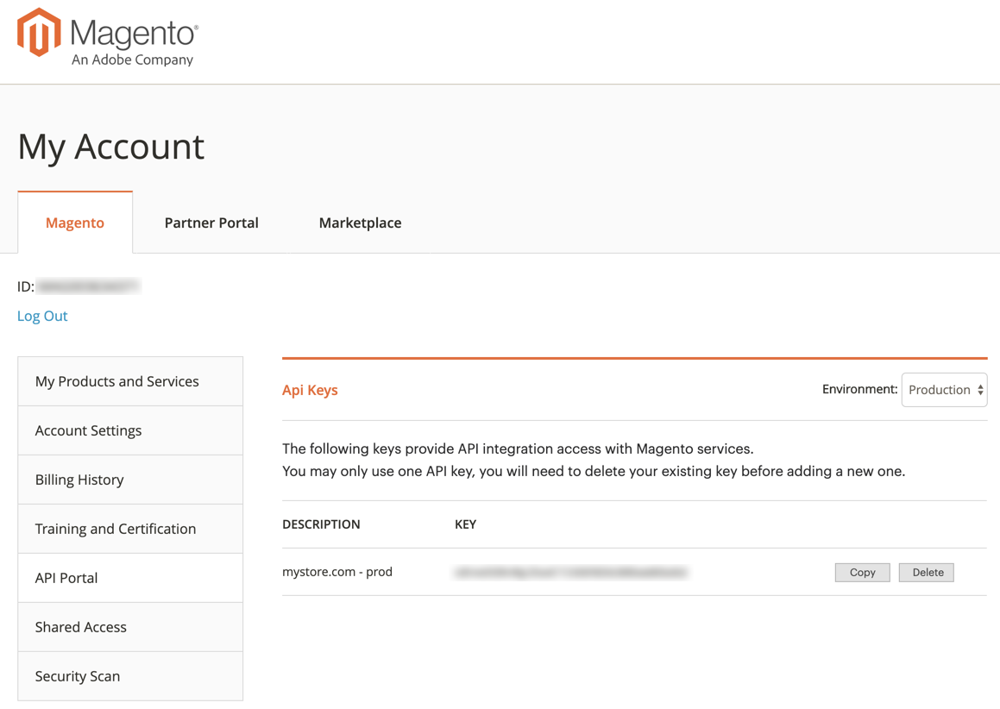
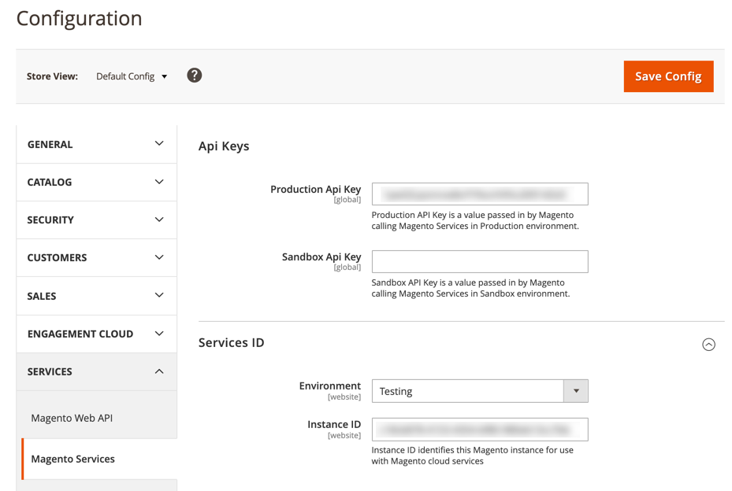

# Install and Configure the Catalog SaaS Export Module

This topic is a requirement to successfully use the [Product Recommendations JS SDK](index.md).

<InlineAlert variant="info" slots="text"/>

This module requires Magento 2.3 or later.

## To Install the Saas Export Module using Composer:

1. Update your `composer.json` file in the Magento root installation directory to provide the location of the Saas Export module.

1. Log in to your Magento server as, or switch to, the Magento file system owner.

1. Change to your Magento root directory.

1. Enter the following commands:

    ```bash
    composer config repositories.magento composer https://repo.magento.com
    composer require magento/saas-export
    ```

1. Follow the steps [here](https://devdocs.magento.com/extensions/install/#verify-the-extension) to verify and enable the module.

## To Configure the Catalog SaaS Export Module using API Keys:

1. Log in to your Magento account at https://account.magento.com.

1. Under the **Magento** tab, select **API Portal** on the sidebar.

1. Generate and copy the API key for **Production**. See to the following image:

    

1. In the Magento Admin, click **Stores** on the Admin panel.

1. Under **Settings**, choose **Configuration**.
  
1. In the panel on the left under **Services**, choose **Magento Services**.
  
1. In the **API Keys** section, paste your key value into the **Production Api Key** field regardless of whether you are in a production environment or non-production environment. See the following image:

    
