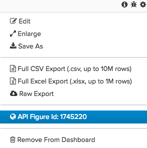
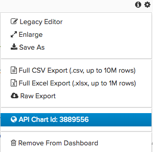

# Export API

The Adobe Commerce Reporting Export API allows you to access some of the raw data behind your Adobe Commerce Reporting dashboard.

Before using the export API, make sure you [authenticate](https://developer.adobe.com/commerce/services/reporting/#generating-authentication-token-for-the-export-api) your connection.

## Raw data exports

<InlineAlert variant="info" slots="text" />

You need a [raw data export](https://docs.magento.com/mbi/tutorials/export-raw-data.html) before calling the following methods.

### List all available raw exports

The `GET /export` call returns a list of raw exports available.

**Endpoint:**
​
`GET /export`
​
**Request:**

```bash
curl -H "X-RJM-API-Key: <your_key>" https://api.rjmetrics.com/0.1/export
```

### Get a specific export

The `GET /export/:id`call returns a zip-compressed CSV file containing the raw data of a completed export.

**Endpoint:**
​
`GET /export/:id`
​
**Request:**

```bash
curl -H "X-RJM-API-Key: <your_key>" https://api.rjmetrics.com/0.1/export/51
```

### Get an export description

The `GET /export/:id/info` call returns a description of the export with the specified ID.

**Endpoint:**
​
`GET /export/:id/info`
​
**Request:**

```bash
curl -H "X-RJM-API-Key: <your_key>" https://api.rjmetrics.com/0.1/export/51/info
```

### Copy an export

Creates a new export with the exact same parameters as the specified export. If you specify the `name` parameter, the new export will be assigned its value.
​
<InlineAlert variant="info" slots="text" />

The API no longer supports modifying the start and end time parameters.

**Endpoint:**
​
`POST /export/:id/copy/name=<ExportName>`
​
**Request:**

```bash
curl -d "name=New Copied Export" -H "X-RJM-API-Key: <your_key>" https://api.rjmetrics.com/0.1/export/51/copy
```

## Data tables

### Get a list of tables

The `GET /client/:clientId/table` call returns a list of tables in the data warehouse of the client corresponding to _clientId_.

**Endpoint:**
​
`GET /client/:clientId/table`
​
**Request:**

```bash
curl -H "X-RJM-API-Key: <your_key>" https://api.rjmetrics.com/0.1/client/12/table
```

### Get a list of table columns

The `GET /client/:clientId/table/:tableId` call returns a list of table columns in the table corresponding to _tableIid_.

**Endpoint:**
​
`GET /client/:clientId/table/:tableId`
​
**Request:**

```bash
curl -H "X-RJM-API-Key: <your_key>" https://api.rjmetrics.com/0.1/client/12/table/3
```

### Create a raw data export of a table

The `POST /client/:clientId/table/:tableId/export` call creates a new raw data export of the entire contents of the table corresponding to _tableId_.
​
<InlineAlert variant="info" slots="text" />

Exports are capped at 10 million rows. Do not try this on very large tables.

**Endpoint:**
​
`POST /client/:clientId/table/:tableId/export`
​
**Request:**

```bash
curl -d "" -H "X-RJM-API-Key: <your_key>" https://api.rjmetrics.com/0.1/client/12/table/3/export
```

## Figures

### Get a list of figures

The `GET /figure` call returns a list of figures that are available for export.

**Endpoint:**
​
`GET /figure`
​
**Request:**

```bash
curl -H "X-RJM-API-Key: your\_key" https://api.rjmetrics.com/0.1/figure
```

### Export figure data

The `POST /figure/:id/export/format=<FormatType>` call outputs the data used to create the figure with the specified ID. Figure IDs can be found in the "Export Figure" dialog in the Adobe Commerce Reporting dashboard interface.



If a figure was created using the [Visual Report Builder](https://docs.magento.com/mbi/data-user/reports/ess-rpt-build-visual.html), you can specify an output format of either `.csv` or `.json`. If a figure was created using the [SQL Report Builder](https://docs.magento.com/mbi/data-analyst/dev-reports/sql-rpt-bldr.html), you can specify an output format of `.csv` only.

**Endpoint:**
​
`POST /figure/:id/export/format=<FormatType>`
​
**Request:**

```bash
curl -d "format=csv&includeColumnHeaders=1" -H "X-RJM-API-Key: your\_key" https://api.rjmetrics.com/0.1/figure/360531/export
```

### Get a figure description

The `POST /figure/:id/info` call returns a description of the specified figure. Figure IDs can be found in the "Export Figure" dialog in the Adobe Commerce Reporting dashboard interface.

**Endpoint:**
​
`POST /figure/:id/info`
​
**Request:**

```bash
curl -H "X-RJM-API-Key: your\_key" https://api.rjmetrics.com/0.1/figure/360531/info
```

## Charts

Export Specific Reports (created by cohort report builder)

### Get a list of charts

The `GET /chart` call returns a list of charts that are available for export.

**Endpoint:**
​
`GET /chart`
​
**Request:**

```bash
curl -H "X-RJM-API-Key: your\_key" https://api.rjmetrics.com/0.1/chart
```

### Export chart data

The `POST /chart/:id/export/format=<FormatType>\]` call outputs the data used to create the specified chart. Chart IDs can be found in the "Export Chart" dialog in the Adobe Commerce Reporting dashboard interface.



The user can specify an output format of either `.csv` or `.json`.

**Endpoint:**
​
`POST /chart/:id/export/format=<FormatType>\]`
​
**Request:**

```bash
curl -d "format=csv&includeColumnHeaders=1" -H "X-RJM-API-Key: your\_key" https://api.rjmetrics.com/0.1/chart/2038112/export
```

### Get a chart description

The `POST /chart/:id/info` call returns a description of the specified chart or a 404 if the chart does not exist. Chart IDs can be found in the "Export Chart" dialog in the Adobe Commerce Reporting dashboard interface.

**Endpoint:**
​
`POST /chart/:id/info`
​
**Request:**

```bash
curl -H "X-RJM-API-Key: your\_key" https://api.rjmetrics.com/0.1/chart/2038112/info
```
