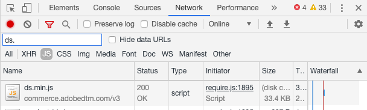
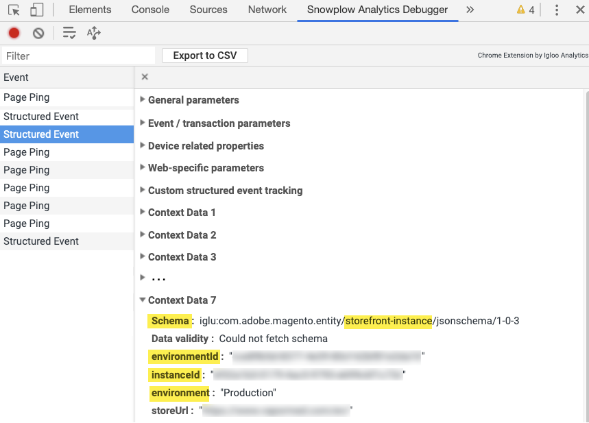

# Verify Event Collection

After you install and configure the [[!DNL Product Recommendations]](https://experienceleague.adobe.com/en/docs/commerce/product-recommendations/getting-started/install-configure) or [[!DNL Live Search]](https://experienceleague.adobe.com/en/docs/commerce/live-search/install) modules, you can verify that the behavioral data is being sent to Adobe Commerce. You can use developer tools available in Chrome, or install the Snowplow Chrome extension. If you need additional help, see [Troubleshoot [!DNL Product Recommendations] module](https://experienceleague.adobe.com/docs/commerce-knowledge-base/kb/troubleshooting/miscellaneous/troubleshoot-product-recommendations-module-in-magento-commerce.html) and [Troubleshoot [!DNL Live Search] module](https://experienceleague.adobe.com/en/docs/commerce/live-search/boundaries-limits#troubleshooting).

<InlineAlert variant="info" slots="text"/>

The [!DNL Data Connection] extension uses queries in Adobe Experience Platform to [verify that event collection](https://experienceleague.adobe.com/en/docs/commerce/data-connection/fundamentals/connect-data#confirm-that-event-data-is-collected) is working.

## Verify using developer tools in Chrome

To ensure that the event collector JS file is loading on all site pages:

1. In Chrome, choose **Customize and control Google Chrome** then select **More Tools** > **Developer Tools**.
1. Choose the **Network** tab then select the **JS** type.
1. Filter for `ds.`
1. Reload the page.
1. You should see `ds.js` or `ds.min.js` in the **Name** column.

_Event Collector JS_

To ensure that events are firing on pages across your site (home, product, checkout, and so on):

1. Make sure you disable any ad blockers on your browser and accept cookies on the site.
1. In Chrome, choose **Customize and control Google Chrome** (the three vertical dots in the upper right corner of the browser) then select **More Tools** > **Developer Tools**.
1. Choose the **Network** tab and filter for `tp2`.
1. Reload the page.
1. You should see calls under `tp2` in the **Name** column.

_Verify that events are firing_

## Verify using Snowplow Chrome extension

Install the [Snowplow Analytics Debugger extension for Chrome](https://chrome.google.com/webstore/detail/snowplow-analytics-debugg/jbnlcgeengmijcghameodeaenefieedm). This extension displays the events being collected and sent to Adobe Commerce.

1. Make sure you disable any ad blockers on your browser and accept cookies on the site.

1. In Chrome, choose **Customize and control Google Chrome** (the three vertical dots in the upper right corner of the browser) then select **More Tools** > **Developer Tools**.

1. Choose the **Snowplow Analytics Debugger** tab.

1. Under the **Event** column, select **Structured Event**.

1. Scroll down until you see **Context Data _n_**. Look for the storefront instance in the **Schema**.

1. Verify that the [SaaS Data Space ID](https://experienceleague.adobe.com/docs/commerce-admin/config/services/saas.html) is set correctly.

_Snowplow Filter_

<InlineAlert variant="info" slots="text"/>

A value of `Data validity : NOT FOUND` in the debugger indicates an internal schema. The Snowplow Chrome plugin cannot validate the events with an internal schema. This has no impact on actual functionality.

## Verify that events are firing correctly

To verify that the events used for metrics are firing correctly, look for the `impression-render`, `view`, and `rec-click` events in the Snowplow Analytics Debugger. See the [full list of events](https://experienceleague.adobe.com/docs/commerce/product-recommendations/developer/events.html).

<InlineAlert variant="info" slots="text"/>

If [Cookie Restriction Mode](https://experienceleague.adobe.com/docs/commerce-admin/start/compliance/privacy/compliance-cookie-law.html) is enabled, Adobe Commerce does not collect behavioral data until the shopper consents. If Cookie Restriction Mode is disabled, behavioral data is collected by default.
